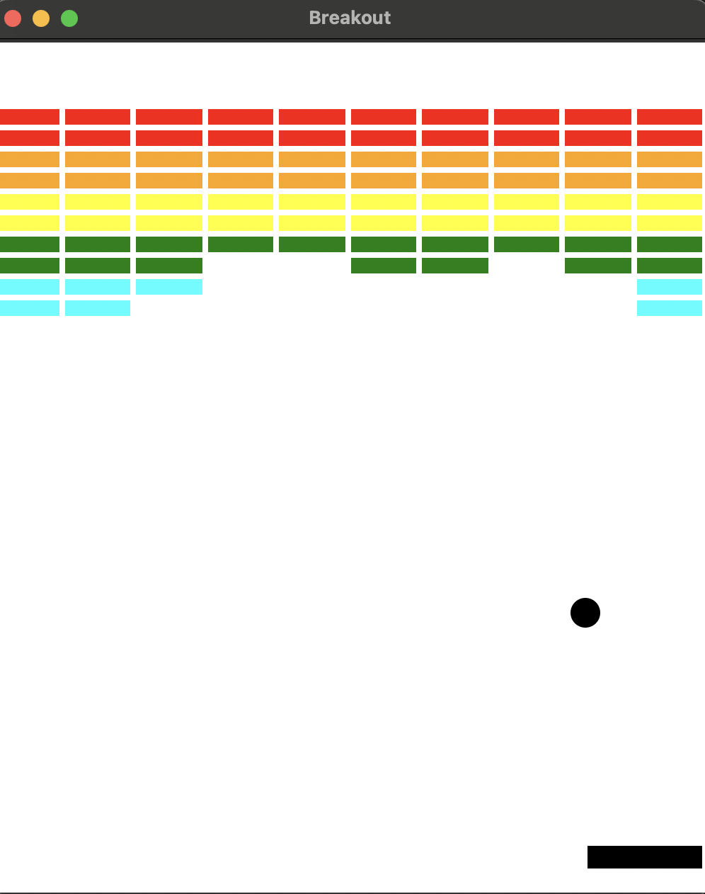

# 🧱 Breakout Game – Python

A simple **Breakout clone** written in Python using `tkinter`. You control the paddle with your mouse and try to break all the bricks. The player has 3 lives!

---

## 🎮 How to Play

- Move the mouse to control the paddle.
- Bounce the ball to break bricks.
- If the ball falls below the paddle, you lose a life.
- Break all the bricks to win the game!

---

## ▶️ Run the Game

Make sure you have **Python 3** installed.

To run the game:

```bash
python main.py
```

If that doesn't work, try:

```bash
python3 main.py
```

The game uses a custom Canvas class defined in `graphics.py`.

---

## 🧠 Technologies Used

- Python 3
- tkinter for graphics
- random and time libraries

---

## 📁 Project Structure

```
breakout_game/
├── graphics.py    # Custom Canvas class using tkinter
├── main.py        # Game logic
└── README.md      # Game info and instructions
```

---

## 📸 Preview



---

## 💡 Features

- 3 lives system 🧡
- Randomized ball direction 🎲
- Color-coded brick rows 🌈
- Paddle follows mouse smoothly 🖱️
- Collision detection with bricks and paddle 🔁

---

## 📌 Author

Made with 💻 by Cristina – GitHub

---

## 📜 License

This project is for educational purposes. Feel free to improve it!
